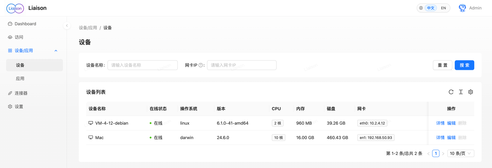
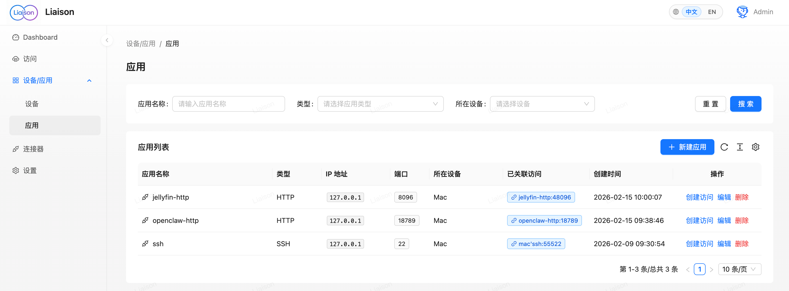
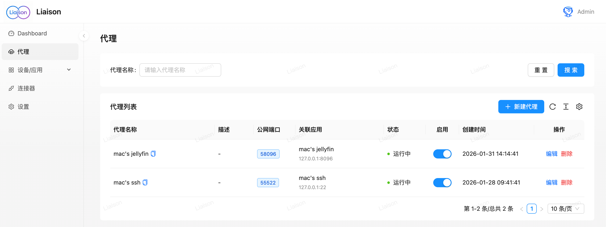
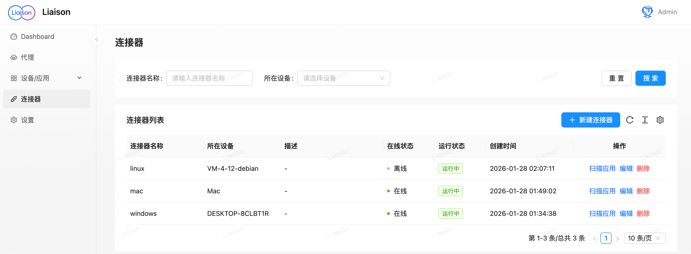

<div align="center">

# Liaison

**让网络马上通达，轻松连接分布在不同位置的设备与应用**

[](https://github.com/singchia/liaison/actions/workflows/go.yml)
[](https://goreportcard.com/report/github.com/singchia/liaison)
[](https://opensource.org/licenses/Apache-2.0)
[](https://github.com/singchia/liaison/stargazers)
[](https://github.com/singchia/liaison/network/members)

[English](./README.en.md) | [中文](./README.md)


[快速开始](#-快速开始) • [特性](#-核心特性) • [使用场景](#-使用场景) • [文档](#-文档) • [贡献](#-贡献)

</div>

---

## ✨ 核心特性

<div align="center">

| 🛡️ **安全可靠** | 🚀 **简单易用** | 🌐 **跨平台** | 🔍 **自动发现** |
|:---:|:---:|:---:|:---:|
| TLS 加密保障连接安全<br/>不暴露内网，随时开启关闭 | Web 界面操作<br/>秒级安装使用 | 支持 Linux/macOS/Windows<br/>x86_64 和 ARM64 | 自动发现设备应用<br/>无需手动配置 |

</div>

### 🎯 为什么选择 Liaison？

- **🔒 企业级安全** - TLS 加密传输，内网穿透方案，不暴露内网，安全可控
- **⚡ 极速部署** - 通过 Web 界面即可完成所有操作，无需复杂配置，秒级安装使用
- **🌍 全平台支持** - 支持 Linux、macOS、Windows 等多种操作系统和架构
- **🤖 智能发现** - 自动发现设备上的应用和服务，零配置即可使用
- **📊 可视化监控** - 实时监控设备状态、流量统计，一目了然

---

## 🚀 快速开始

### 📦 安装服务端

**1. 下载安装包**

```bash
# 下载最新版本
wget https://github.com/singchia/liaison/releases/download/v1.2.4/liaison-v1.2.4-linux-amd64.tar.gz

# 解压
tar -xzf liaison-v1.2.4-linux-amd64.tar.gz
cd liaison-v1.2.4-linux-amd64
```

**2. 运行安装脚本**

```bash
sudo ./install.sh
```

安装过程中会提示输入公网地址或域名，30 秒内未输入将自动使用检测到的公网 IP。

**3. 访问 Web 控制台**

安装完成后，访问 `https://你的公网IP` 即可进入 Web 控制台。

> 💡 **提示**: 默认管理员账号密码请查看安装脚本输出或配置文件

### 🔌 安装连接器

**1. 创建连接器**

在 Web 控制台中创建连接器，获取 `Access Key` 和 `Secret Key`。

**2. 在目标设备上安装**

**Linux/macOS:**
```bash
curl -sSL https://你的服务地址/install.sh | bash -s -- \
  --access-key=YOUR_ACCESS_KEY \
  --secret-key=YOUR_SECRET_KEY
```

**Windows:**
```powershell
# 下载安装脚本
Invoke-WebRequest -Uri "https://你的服务地址/install.ps1" -OutFile "install.ps1"

# 运行安装
.\install.ps1 -AccessKey "YOUR_ACCESS_KEY" -SecretKey "YOUR_SECRET_KEY"
```

**3. 等待自动连接**

等待几秒钟，设备会自动出现在控制台中，无需额外配置！

---

## 📋 系统要求

| 组件 | 要求 |
|:---|:---|
| **服务端** | Linux 系统（推荐 Ubuntu 20.04+ 或 CentOS 7+） |
| **连接器** | Linux / macOS / Windows（支持 x86_64 和 ARM64 架构） |
| **浏览器** | Chrome 90+, Firefox 88+, Safari 14+, Edge 90+ |

---

## 🏗️ 架构说明

<div align="center">


**Liaison 采用中心化架构，通过 Frontier 服务统一管理所有连接器**

</div>

### 核心组件

- **Manager** - 管理中心，提供 Web 界面和 API
- **Frontier** - 连接器网关，处理所有连接器的连接和通信
- **Edge** - 连接器客户端，部署在目标设备上

---

## 💡 使用场景

<div align="center">

| 🏠 **远程办公** | 📦 **NAS 伴侣** | 🏢 **多机房部署** | ⚡ **边缘计算** |
|:---:|:---:|:---:|:---:|
| 连接办公室和家中的设备<br/>随时随地访问 | 随时从互联网访问<br/>家庭 NAS | 统一连接分布在不同<br/>机房的服务器 | 连接和监控边缘设备<br/>上的应用和服务 |

</div>

### 典型应用

- 🏡 **家庭网络** - 访问家庭 NAS、智能家居设备
- 💼 **远程开发** - 连接办公室服务器，远程开发调试
- 🏢 **企业内网** - 安全访问内网服务，不暴露内网
- 🌐 **多地域部署** - 统一管理分布在不同地区的设备
- 🔧 **运维管理** - 远程管理服务器，监控设备状态

---

## 📸 功能展示

<div align="center">

### 仪表盘


### 设备管理


### 应用管理


### 代理配置


### 连接器管理


</div>

---

## 📚 文档

- [业务流程图](./docs/biz_sequence.md)
- [API 文档](./docs/swagger/)
- [安装指南](./dist/liaison/README.md)
- [连接器安装](./dist/edge/README.md)

---

## 🤝 贡献

我们欢迎所有形式的贡献！

- 🐛 [报告 Bug](https://github.com/singchia/liaison/issues/new?template=bug_report.md)
- 💡 [提出建议](https://github.com/singchia/liaison/issues/new?template=feature_request.md)
- 📝 [提交 PR](https://github.com/singchia/liaison/pulls)
- 📖 [改进文档](https://github.com/singchia/liaison/issues/new?template=documentation.md)

### 贡献指南

1. Fork 本仓库
2. 创建特性分支 (`git checkout -b feature/AmazingFeature`)
3. 提交更改 (`git commit -m 'Add some AmazingFeature'`)
4. 推送到分支 (`git push origin feature/AmazingFeature`)
5. 开启 Pull Request

---

## 📄 许可证

本项目采用 [Apache License 2.0](LICENSE) 许可证。

```
Copyright 2026 Liaison Contributors

Licensed under the Apache License, Version 2.0 (the "License");
you may not use this file except in compliance with the License.
You may obtain a copy of the License at

    http://www.apache.org/licenses/LICENSE-2.0

Unless required by applicable law or agreed to in writing, software
distributed under the License is distributed on an "AS IS" BASIS,
WITHOUT WARRANTIES OR CONDITIONS OF ANY KIND, either express or implied.
See the License for the specific language governing permissions and
limitations under the License.
```

---

## ⭐ Star History

[](https://star-history.com/#singchia/liaison&Date)

---

## 🙏 致谢

感谢所有为 Liaison 做出贡献的开发者！

---

<div align="center">

**如果这个项目对你有帮助，请给一个 ⭐ Star！**

Made with ❤️ by [Liaison Contributors](https://github.com/singchia/liaison/graphs/contributors)

[GitHub](https://github.com/singchia/liaison) • [Issues](https://github.com/singchia/liaison/issues) • [Discussions](https://github.com/singchia/liaison/discussions)

</div>
