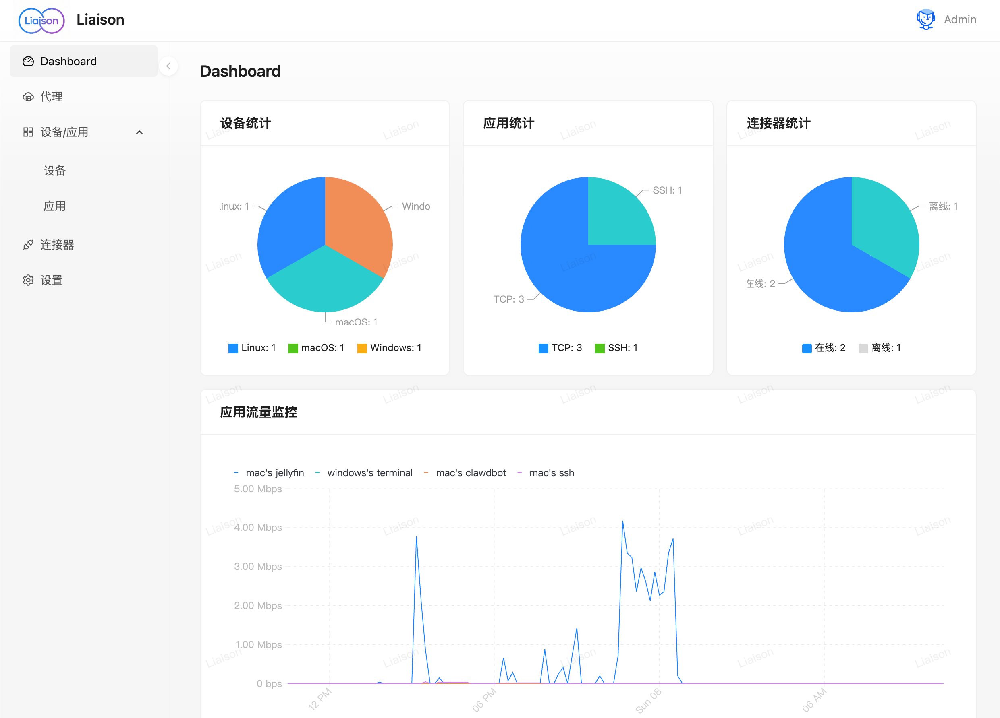

# Liaison

> 网络马上通达，Liaison 让你可以轻松连接分布在不同位置的设备与应用。无论你的设备在家、办公室或机房，都能通过 Liaison 建立稳定、安全的网络连接。

[](https://github.com/singchia/liaison/actions/workflows/go.yml)
[](https://goreportcard.com/report/github.com/singchia/liaison)
[](https://opensource.org/licenses/Apache-2.0)


---



## 为什么选择 Liaison？

- **安全可靠** - 内网穿透方案，不暴露内网，TLS保障连接安全，随时开启和关闭代理
- **简单易用** - 通过 Web 界面即可完成所有操作，无需复杂的命令行配置，秒级安装使用
- **跨平台支持** - 支持连接 Linux、macOS、Windows 等多种操作系统
- **自动发现** - 自动发现设备上的应用和服务，无需手动配置


## 快速开始

### 安装服务端

1. 下载安装包 [liaison-v1.2.0-linux-amd64.tar.gz](https://github.com/singchia/liaison/releases/download/v1.2.0/liaison-v1.2.0-linux-amd64.tar.gz) 并解压
2. 进入解压后的目录，运行安装脚本：
   ```bash
   tar -xzf liaison-v1.1.0-linux-amd64.tar.gz
   cd liaison-v1.1.0-linux-amd64
   sudo ./install.sh
   ```
3. 访问 Web 控制台（默认地址：https://公网IP）

### 安装连接器

1. 在 Web 控制台中创建连接器，获取 Access Key 和 Secret Key
2. 在目标设备上运行安装命令：
   ```bash
   curl -sSL https://服务地址/install.sh | bash -s -- \
     --access-key=YOUR_ACCESS_KEY \
     --secret-key=YOUR_SECRET_KEY \ ...
   ```
3. 等待几秒钟，设备会自动出现在控制台中

就这么简单！现在你可以开始配置代理并连接到你的设备上。

### 系统要求

- **服务端**: Linux 系统
- **连接器**: Linux、macOS、Windows（支持 x86_64 和 ARM64 架构）

## 架构说明


## 使用场景

- **远程办公/开发** - 连接办公室和家中的设备，随时随地访问
- **NAS伴侣** - 随时从互联网访问家庭NAS
- **多机房部署** - 统一连接分布在不同机房的服务器和设备
- **边缘计算** - 连接和监控边缘设备上的应用和服务
- **内网穿透** - 让内网服务可以通过公网安全访问


## 许可证

Apache License 2.0

详见 [LICENSE](LICENSE) 文件。

## 版本

当前版本: v1.2.0

---

如有问题或建议，欢迎提交 Issue 或 PR。