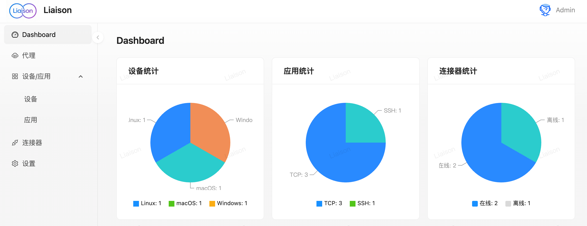
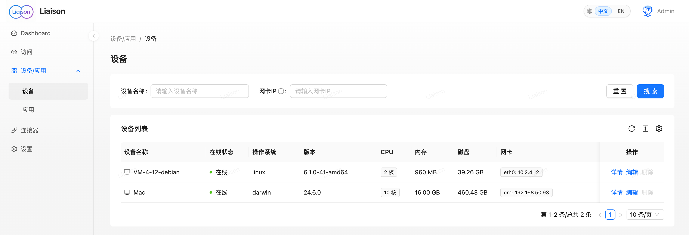
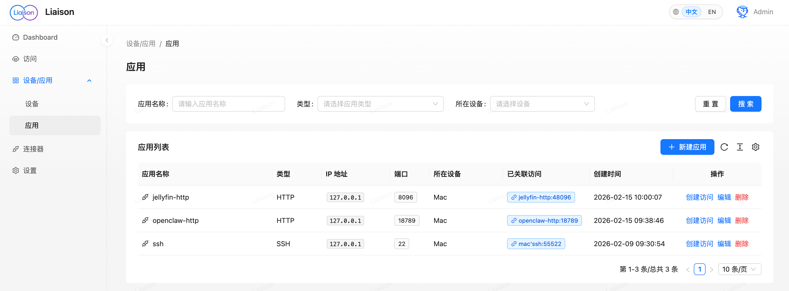
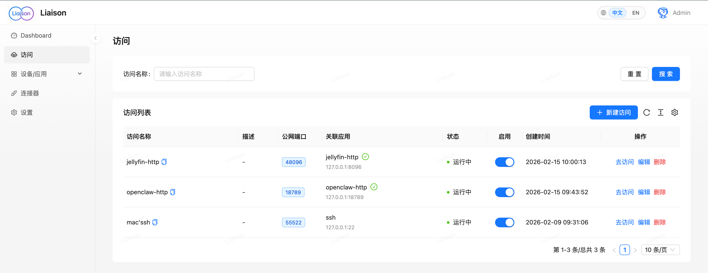

#  Liaison

简体中文 | [English](./README.md)

[](https://github.com/singchia/liaison/actions/workflows/go.yml)
[](https://goreportcard.com/report/github.com/singchia/liaison)
[](https://opensource.org/licenses/Apache-2.0)
[](#技术栈一览)
[](#)

> **网络马上通达，轻松连接分布在不同位置的设备与应用**



| Jellyfin（随时随地看家庭影片） | OpenClaw（随时随地用家庭 AI 助手） |
|:---:|:---:|
|  |  |

[快速开始](#-快速开始) • [简介](#-项目简介) • [文档](#-文档) • [贡献](#-贡献)


---

## 📖 项目简介

Liaison 是一个企业级应用访问解决方案，不暴露任何内网端口，随时开启关闭。它提供了完整的产品功能，支持自动发现设备应用，实时流量统计，以及安全的 TLS 加密传输。

本项目主要解决以下问题：

- **内网穿透难题**：无需复杂配置，即可从公网访问内网设备和服务
- **多设备管理**：统一管理分布在不同位置的设备，支持 Linux/macOS/Windows 全平台
- **安全连接**：TLS 加密保障连接安全，不暴露内网，随时开启关闭
- **流量监控**：实时监控设备状态、流量统计，为运维和容量评估提供数据依据
- **应用代理**：支持 TCP、HTTP/HTTPS、WebSocket 等多种协议的应用代理

适用场景：

<div align="center">

| **💼 远程办公与开发** | **🧑‍💻 个人工作室** | **🏠 家庭网络 / NAS** | **🌐 多机房 / 多地域部署** | **⚡ 边缘计算与运维管理** |
|:---:|:---:|:---:|:---:|:---:|
| 连接办公室和家中设备，随时远程开发与调试 | 安全连接工作站与私有环境，统一访问创作设备 | 从公网访问家庭 NAS 与智能家居服务 | 连接分布在不同机房和地域的服务器与应用 | 连接并监控边缘设备应用，远程巡检状态与流量 |

</div>

---

## 🚀 快速开始

### 📦 安装服务端

**1. 下载安装包并运行安装脚本**

```bash
# 下载最新版本
wget https://github.com/singchia/liaison/releases/download/v1.3.1/liaison-v1.3.1-linux-amd64.tar.gz

# 解压
tar -xzf liaison-v1.3.1-linux-amd64.tar.gz
cd liaison-v1.3.1-linux-amd64
sudo ./install.sh
```

安装过程中会提示输入公网地址或域名，30 秒内未输入将自动使用检测到的公网 IP。

**2. 访问 Web 控制台**

安装完成后，访问 `https://你的公网IP` 即可进入 Web 控制台。

> 💡 **提示**: 默认管理员账号密码请查看安装脚本输出或配置文件

### 🔌 安装连接器

在 Web 控制台**新建连接器**，在页面上拷贝对应平台的安装命令，在目标设备上执行即可完成安装。安装后连接器会自动出现在控制台中。

---

## 📋 系统要求

| 组件 | 要求 |
|:---|:---|
| **服务端** | Linux 系统（推荐 Ubuntu 20.04+ 或 CentOS 7+） |
| **连接器** | Linux / macOS / Windows（支持 x86_64 和 ARM64 架构） |
| **浏览器** | Chrome 90+, Firefox 88+, Safari 14+, Edge 90+ |

---

## 🏗️ 架构说明

<div align="center">


**中心化架构，通过Liaison服务统一管理所有连接器**

</div>

### 核心组件

- **Liaison** - 管理中心，提供 Web 界面和 API，访问入口
- **Frontier** - 连接器网关，处理所有连接器的连接和通信
- **Edge** - 连接器客户端，部署在目标设备上

---

## 📸 功能展示

| 功能 | 截图 |
|:---:|:---:|
| 设备管理 |  |
| 应用管理 |  |
| 代理配置 |  |
| 连接器管理 |  |

---

## 📚 文档

- [业务流程图](./docs/biz_sequence.md)
- [API 文档](./docs/swagger/)

---

## 🤝 贡献

我们欢迎所有形式的贡献！

- 🐛 [报告 Bug](https://github.com/singchia/liaison/issues/new?template=bug_report.md)
- 💡 [提出建议](https://github.com/singchia/liaison/issues/new?template=feature_request.md)
- 📝 [提交 PR](https://github.com/singchia/liaison/pulls)
- 📖 [改进文档](https://github.com/singchia/liaison/issues/new?template=documentation.md)

### 贡献指南

1. Fork 本仓库
2. 创建特性分支 (`git checkout -b feature/AmazingFeature`)
3. 提交更改 (`git commit -m 'Add some AmazingFeature'`)
4. 推送到分支 (`git push origin feature/AmazingFeature`)
5. 开启 Pull Request

---

## 📄 许可证

本项目采用 [Apache License 2.0](LICENSE) 许可证。

---

<div align="center">

**如果这个项目对你有帮助，请给一个 ⭐ Star！**

Made with ❤️ by [Liaison Contributors](https://github.com/singchia/liaison/graphs/contributors)

<p align=center>

</p>


[GitHub](https://github.com/singchia/liaison) • [Issues](https://github.com/singchia/liaison/issues) • [Discussions](https://github.com/singchia/liaison/discussions)

</div>
