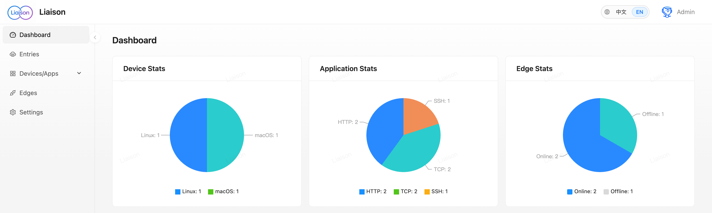
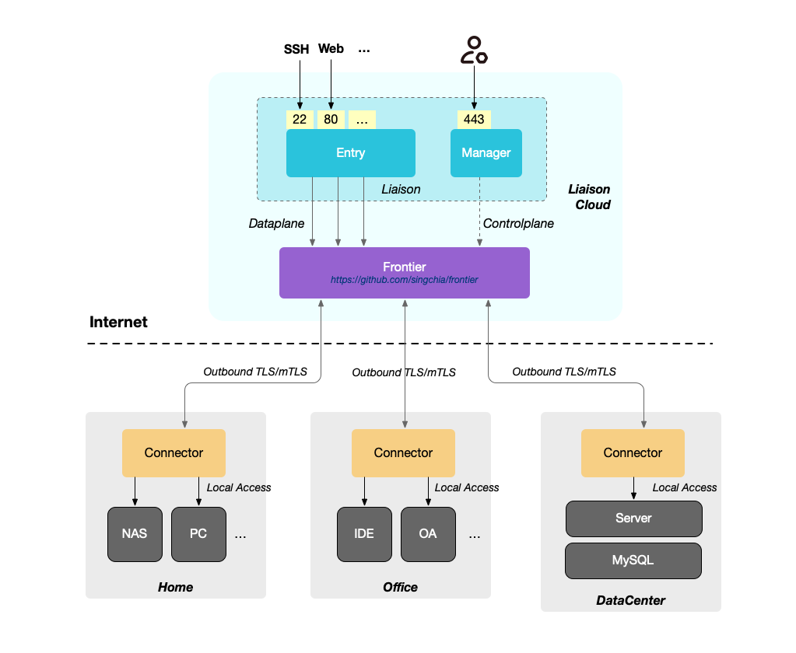
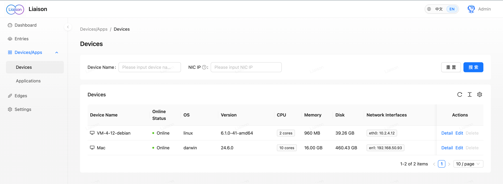
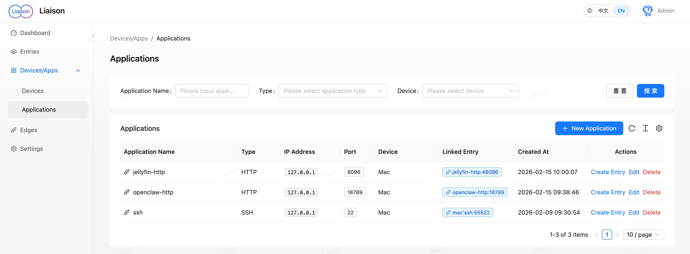
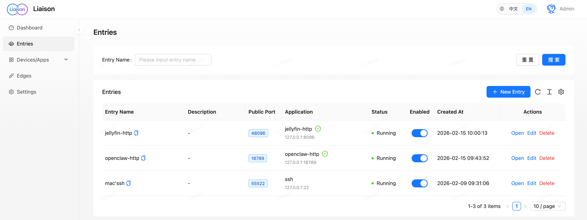
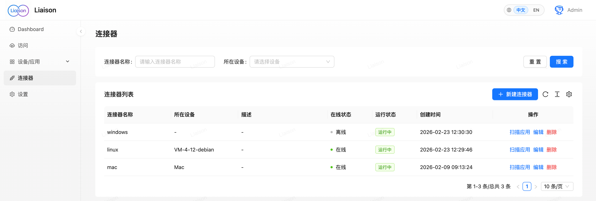

#  Liaison

[中文](./README.md) | English

[](https://github.com/singchia/liaison/actions/workflows/go.yml)
[](https://goreportcard.com/report/github.com/singchia/liaison)
[](https://opensource.org/licenses/Apache-2.0)
[](#)
[](#)

> **Network connectivity made simple — Easily connect devices and applications across different locations**



[Quick Start](#quick-start) • [Introduction](#introduction) • [Documentation](#documentation) • [Contributing](#contributing)

---

## Introduction

Liaison is an enterprise-grade application access solution that does not expose any internal ports and can be enabled or disabled at any time. It provides full product features: auto-discovery of device applications, real-time traffic statistics, and secure TLS-encrypted transport.

This project addresses:

- **Intranet access** — Access internal devices and services from the public internet without complex setup
- **Multi-device management** — Manage devices across locations with Linux/macOS/Windows support
- **Secure connectivity** — TLS encryption, no exposure of the internal network, enable or disable at any time
- **Traffic monitoring** — Real-time device status and traffic metrics for operations and capacity planning
- **Application proxy** — TCP, HTTP/HTTPS, WebSocket and other protocols

Use cases:

<div align="center">

| **💼 Remote Work & Dev** | **🧑‍💻 Personal Studio** | **🏠 Home Network / NAS** | **🌐 Multi-datacenter / Multi-region** | **⚡ Edge & Ops** |
|:---:|:---:|:---:|:---:|:---:|
| Connect office and home devices for remote development and debugging | Securely connect workstations and private environments with unified device management | Access home NAS and smart-home services from the public internet | Unified connectivity for servers and applications across regions and datacenters | Connect and monitor edge applications with remote health and traffic checks |

</div>

---

## Quick Start

### Install Server

**1. Download**

```bash
wget https://github.com/singchia/liaison/releases/download/v1.3.1/liaison-v1.3.1-linux-amd64.tar.gz
tar -xzf liaison-v1.3.1-linux-amd64.tar.gz
cd liaison-v1.3.1-linux-amd64
```

**2. Run install script**

```bash
sudo ./install.sh
```

You will be prompted for a public IP or domain; if none is entered within 30 seconds, the detected public IP is used.

**3. Open Web console**

Visit `https://your-public-ip` to access the Web console.

> **Tip:** Default admin credentials are shown in the install script output or config.

### Install Connector

**Create a new connector** in the Web console, copy the install command for your platform from the page, and run it on the target device. The connector will appear in the console automatically.

---

## System Requirements

| Component | Requirements |
|:---|:---|
| **Server** | Linux (Ubuntu 20.04+ or CentOS 7+ recommended) |
| **Connector** | Linux / macOS / Windows (x86_64 and ARM64) |
| **Browser** | Chrome 90+, Firefox 88+, Safari 14+, Edge 90+ |

---

## Architecture



Liaison uses a centralized architecture with Frontier managing all connectors.

**Components**

- **Liaison** — Web UI and API, Entries for applications
- **Frontier** — Connector gateway for connections and traffic
- **Edge** — Connector client on target devices

---

## Feature Showcase

| Feature | Screenshot |
|:---:|:---:|
| Device Management |  |
| Application Management |  |
| Proxy Configuration |  |
| Edge Management |  |

---

## Documentation

- [Business flow](./docs/biz_sequence.md)
- [API](./docs/swagger/)

---

## Contributing

Contributions are welcome.

- [Report a bug](https://github.com/singchia/liaison/issues/new?template=bug_report.md)
- [Suggest a feature](https://github.com/singchia/liaison/issues/new?template=feature_request.md)
- [Open a PR](https://github.com/singchia/liaison/pulls)
- [Improve docs](https://github.com/singchia/liaison/issues/new?template=documentation.md)

1. Fork the repo  
2. Create a branch (`git checkout -b feature/AmazingFeature`)  
3. Commit (`git commit -m 'Add some AmazingFeature'`)  
4. Push (`git push origin feature/AmazingFeature`)  
5. Open a Pull Request  

---

## License

[Apache License 2.0](LICENSE).

---

## Star History

[](https://star-history.com/#singchia/liaison&Date)

---

<div align="center">

**If this project helps you, please give it a ⭐ Star!**

Made with ❤️ by [Liaison Contributors](https://github.com/singchia/liaison/graphs/contributors)

[GitHub](https://github.com/singchia/liaison) • [Issues](https://github.com/singchia/liaison/issues) • [Discussions](https://github.com/singchia/liaison/discussions)

</div>
