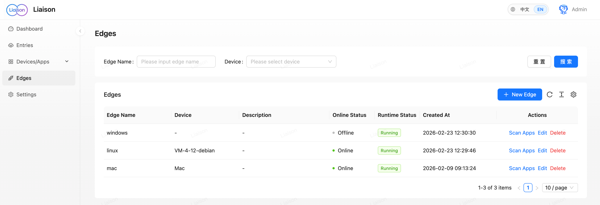

#  Liaison

[English](./README.md) | [简体中文](./README_zh.md) | [日本語](./README_ja.md) | [한국어](./README_ko.md) | [Español](./README_es.md) | [Français](./README_fr.md) | Deutsch

[](https://github.com/liaisonio/liaison/actions/workflows/go.yml)
[](https://goreportcard.com/report/github.com/liaisonio/liaison)
[](https://opensource.org/licenses/Apache-2.0)
[](#)
[](#)

> **Konnektor-basierter Zugriff auf Geräte und Apps hinter NAT**


| Jellyfin (Heimfilme überall streamen) | OpenClaw (Heim-KI überall nutzen) |
|:---:|:---:|
|  |  |

[Schnellstart](#schnellstart) • [Einführung](#einführung) • [Dokumentation](#dokumentation) • [Mitwirken](#mitwirken)

---

## Einführung

Liaison ist eine Enterprise-taugliche Lösung für Anwendungszugriff, die jederzeit ein- und ausgeschaltet werden kann, ohne Ports im LAN oder Heimnetz zu öffnen. Sie bietet ein vollständiges Feature-Set: automatische App-Erkennung auf verbundenen Geräten, Echtzeit-Traffic-Metriken und sichere TLS-verschlüsselte Kommunikation.

Dieses Projekt adressiert:

- **Zugriff auf private Netze** — Geräte und Dienste hinter NAT mit minimaler Konfiguration aus dem öffentlichen Internet erreichen
- **Multi-Device-Management** — Geräte an verschiedenen Standorten mit Linux/macOS/Windows-Support verwalten
- **Sichere Konnektivität** — TLS-verschlüsseltes Transport, ohne LAN- oder Heimnetz-Ports freizugeben
- **Firewall je Entry** — Source-IP-CIDR-Whitelist auf jedem TCP- oder HTTP-Entry, wird beim Verbindungsaufbau durchgesetzt
- **Traffic-Monitoring** — Echtzeit-Gerätestatus und Traffic-Metriken für Betrieb und Kapazitätsplanung
- **Anwendungs-Proxy** — TCP, HTTP/HTTPS, WebSocket und weitere Protokolle
- **API-Automatisierung** — Personal Access Tokens (PAT) für CLI/Skripte, Browser-basierter Login-Flow unter `/cli-auth`

Anwendungsfälle:

<div align="center">

| **💼 Remote Work & Dev** | **🧑‍💻 Personal Studio** | **🏠 Heimnetz / NAS** | **🌐 Multi-DC / Multi-Region** | **⚡ Edge & Ops** |
|:---:|:---:|:---:|:---:|:---:|
| Büro- und Heim-Geräte verbinden — Remote-Entwicklung und -Debugging | Workstations und private Umgebungen sicher verbinden, Geräte zentral verwalten | Heim-NAS und Smart-Home-Dienste aus dem Internet erreichen | Einheitliche Konnektivität zwischen Servern und Anwendungen über Regionen und DCs | Edge-Anwendungen verbinden, per Remote Health- und Traffic-Checks überwachen |

</div>

---

## Schnellstart

Wähle eine der beiden Server-Deployment-Optionen, danach installiere einen Konnektor.

### Server installieren — Option 1: Binary + systemd

**1. Herunterladen**

```bash
wget https://github.com/liaisonio/liaison/releases/download/v1.5.0/liaison-1.5.0-linux-amd64.tar.gz
tar -xzf liaison-1.5.0-linux-amd64.tar.gz
cd liaison-1.5.0-linux-amd64
```

**2. Installationsskript ausführen**

```bash
sudo ./install.sh
```

Öffentliche IP oder Domain werden abgefragt. Ohne Eingabe innerhalb von 30 Sekunden wird die erkannte öffentliche IP verwendet.

**3. Web-Konsole öffnen**

Öffne `https://deine-öffentliche-ip`, um die Web-Konsole zu erreichen.

> **Hinweis:** Die Standard-Admin-Zugangsdaten erscheinen in der Ausgabe von install.sh oder in der Konfiguration.

### Server installieren — Option 2: Docker Compose

Erfordert Docker 20.10+ und das `docker compose`-Plugin. Das Bundle liefert `liaison` (Web-Konsole + API) und `frontier` (Konnektor-Gateway) als zwei Container; die Images sind vorgebaut — kein Registry oder Source-Checkout nötig.

```bash
wget https://github.com/liaisonio/liaison/releases/download/v1.5.0/liaison-1.5.0-docker-amd64.tar.gz
tar -xzf liaison-1.5.0-docker-amd64.tar.gz
cd liaison-1.5.0-docker-amd64
./load.sh
```

`load.sh` erkennt automatisch die öffentliche IP (mit 30-Sekunden-Bestätigungszähler), lädt die Images, startet den Stack und gibt das einmalige Admin-Passwort aus, sobald liaison bereit ist. Speichere das Passwort und melde dich unter `https://<öffentliche-ip>` an.

Daten (`data/` SQLite), TLS-Zertifikate (`certs/`) und Logs (`logs/`) werden neben der `docker-compose.yaml` als Bind-Mount persistiert. Siehe [`deploy/docker/README.md`](deploy/docker/README.md) für Source-Builds, Upgrade, Reset, Reverse-Proxy und eigene Zertifikate.

### Konnektor installieren

**Erstelle einen neuen Konnektor** in der Web-Konsole, kopiere den Installationsbefehl für deine Plattform aus der UI und führe ihn auf dem Zielgerät aus. Der Konnektor erscheint automatisch in der Konsole.

---

## Systemanforderungen

| Komponente | Anforderungen |
|:---|:---|
| **Server** | Linux (Ubuntu 20.04+ oder CentOS 7+ empfohlen) |
| **Konnektor** | Linux / macOS / Windows (x86_64 und ARM64) |
| **Browser** | Chrome 90+, Firefox 88+, Safari 14+, Edge 90+ |

---

## Architektur


Liaison nutzt eine zentralisierte Architektur, bei der Frontier alle Konnektoren verwaltet.

**Komponenten**

- **Liaison** — Web-UI und API, plus Applikations-Entry-Points
- **Frontier** — Konnektor-Gateway, verwaltet Verbindungen und Traffic-Routing
- **Edge** — Konnektor-Client auf den Zielgeräten

---

## Feature-Showcase

| Feature | Screenshot |
|:---:|:---:|
| Geräteverwaltung |  |
| Anwendungsverwaltung |  |
| Proxy-Konfiguration |  |
| Konnektor-Verwaltung |  |

---

## Dokumentation

- [Business Flow](./docs/biz_sequence.md)
- [API](./docs/swagger/)

---

## Mitwirken

Beiträge sind willkommen.

- [Bug melden](https://github.com/liaisonio/liaison/issues/new?template=bug_report.md)
- [Feature vorschlagen](https://github.com/liaisonio/liaison/issues/new?template=feature_request.md)
- [PR eröffnen](https://github.com/liaisonio/liaison/pulls)
- [Dokumentation verbessern](https://github.com/liaisonio/liaison/issues/new?template=documentation.md)

1. Repository forken
2. Branch erstellen (`git checkout -b feature/AmazingFeature`)
3. Committen (`git commit -m 'Add some AmazingFeature'`)
4. Pushen (`git push origin feature/AmazingFeature`)
5. Pull Request öffnen

---

## Lizenz

[Apache License 2.0](LICENSE).

---

<div align="center">

**Wenn das Projekt dir hilft, vergib bitte einen ⭐ Star!**

Made with ❤️ by [Liaison Contributors](https://github.com/liaisonio/liaison/graphs/contributors)

[GitHub](https://github.com/liaisonio/liaison) • [Issues](https://github.com/liaisonio/liaison/issues) • [Discussions](https://github.com/liaisonio/liaison/discussions)

</div>
