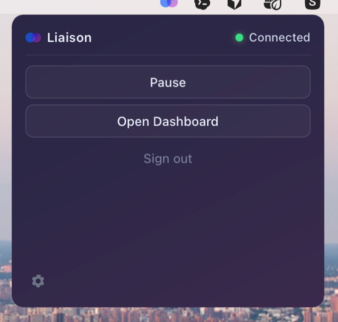
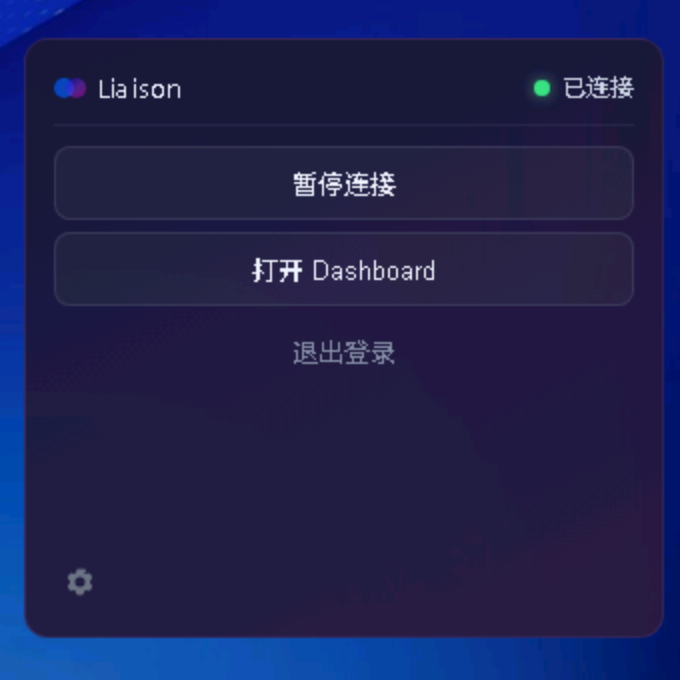

#  Liaison

> **Acceso mediante conectores a dispositivos y apps detrás de NAT**

[](https://github.com/liaisonio/liaison/actions/workflows/go.yml)
[](https://goreportcard.com/report/github.com/liaisonio/liaison)
[](https://opensource.org/licenses/Apache-2.0)
[](#)
[](#)

[简体中文](./README.md) | [English](./README_en.md) | [日本語](./README_ja.md) | [한국어](./README_ko.md) | Español | [Français](./README_fr.md) | [Deutsch](./README_de.md)


| Jellyfin (ver películas caseras en cualquier lugar) | OpenClaw (usar la IA doméstica en cualquier lugar) |
|:---:|:---:|
|  |  |

[Inicio rápido](#inicio-rápido) • [Introducción](#introducción) • [Documentación](#documentación) • [Contribuir](#contribuir)

---

## Introducción

Liaison es una solución empresarial de acceso a aplicaciones que se puede activar o desactivar en cualquier momento, sin exponer puertos en tu LAN o red doméstica. Ofrece un conjunto completo de funciones: descubrimiento automático de aplicaciones en los dispositivos conectados, métricas de tráfico en tiempo real y transporte cifrado con TLS.

Este proyecto resuelve:

- **Acceso a red privada** — Alcanzar dispositivos y servicios detrás de NAT desde internet público con configuración mínima
- **Gestión multi-dispositivo** — Administrar dispositivos en varias ubicaciones con soporte para Linux/macOS/Windows
- **Conectividad segura** — Transporte cifrado con TLS sin exponer puertos en tu LAN o red doméstica
- **Firewall por entrada** — Lista de permitidos por CIDR de IP de origen en cada entrada TCP o HTTP, aplicada al aceptar la conexión
- **Monitoreo de tráfico** — Estado del dispositivo y métricas de tráfico en tiempo real para operaciones y planificación de capacidad
- **Proxy de aplicaciones** — Protocolos TCP, HTTP/HTTPS, WebSocket y otros
- **Automatización de la API** — Personal Access Tokens (PAT) para CLI / scripts con un flujo de inicio de sesión mediado por navegador en `/cli-auth`

Casos de uso:

<div align="center">

| **💼 Trabajo remoto & Dev** | **🧑‍💻 Estudio personal** | **🏠 Red doméstica / NAS** | **🌐 Multi-DC / Multi-región** | **⚡ Edge & Ops** |
|:---:|:---:|:---:|:---:|:---:|
| Conectar dispositivos de oficina y hogar para desarrollo y depuración remotos | Conectar de forma segura estaciones de trabajo y entornos privados con gestión unificada | Acceder al NAS doméstico y servicios smart-home desde internet | Conectividad unificada entre servidores y aplicaciones en regiones y DCs | Conectar y monitorizar aplicaciones edge con chequeos remotos |

</div>

---

## Inicio rápido

Elige una de las dos opciones de despliegue del servidor y luego instala un conector.

### Instalar el servidor — Opción 1: Binario + systemd

**1. Descargar**

```bash
wget https://github.com/liaisonio/liaison/releases/download/v1.5.0/liaison-1.5.0-linux-amd64.tar.gz
tar -xzf liaison-1.5.0-linux-amd64.tar.gz
cd liaison-1.5.0-linux-amd64
```

**2. Ejecutar el script de instalación**

```bash
sudo ./install.sh
```

Se te pedirá una IP pública o dominio; si no introduces nada en 30 segundos, se usará la IP pública detectada.

**3. Abrir la consola web**

Visita `https://tu-ip-publica` para acceder a la consola web.

> **Sugerencia:** Las credenciales de admin por defecto aparecen en la salida de install.sh o en el archivo de configuración.

### Instalar el servidor — Opción 2: Docker Compose

Requiere Docker 20.10+ y el plugin `docker compose`. El paquete provee `liaison` (consola web + API) y `frontier` (gateway de conectores) como dos contenedores; las imágenes vienen pre-compiladas — no se necesita registry ni checkout del código fuente.

```bash
wget https://github.com/liaisonio/liaison/releases/download/v1.5.0/liaison-1.5.0-docker-amd64.tar.gz
tar -xzf liaison-1.5.0-docker-amd64.tar.gz
cd liaison-1.5.0-docker-amd64
./load.sh
```

`load.sh` detecta automáticamente tu IP pública (con una confirmación de 30 segundos), carga las imágenes, arranca el stack e imprime la contraseña de admin de un solo uso cuando liaison está listo. Guarda la contraseña y abre `https://<ip-publica>` para iniciar sesión.

Los datos (`data/` SQLite), certificados TLS (`certs/`) y logs (`logs/`) se montan mediante bind-mount junto a `docker-compose.yaml` para persistencia. Consulta [`deploy/docker/README.md`](deploy/docker/README.md) para compilación desde fuente, upgrade, reset, proxy inverso y certificado personalizado.

### Instalar el conector

Dos rutas de instalación, elige la que se adapte al dispositivo objetivo.

#### Opción A — Liaison Desktop (GUI, macOS / Windows)

App de barra de menú / bandeja del sistema que envuelve al conector y ofrece inicio de sesión con un clic, indicador de estado, pausar / reanudar y acceso al dashboard con un clic. Ideal para portátiles y estaciones de trabajo.

<div align="center">

| macOS | Windows |
|:---:|:---:|
|  |  |

</div>

- **Inicio de sesión con un clic** — flujo OAuth mediado por navegador, PAT almacenado en el llavero del SO (Keychain en macOS, Administrador de credenciales en Windows)
- **Multi-despliegue** — por defecto en `liaison.cloud`; el icono de engranaje en la esquina inferior izquierda permite cambiar a cualquier despliegue privado sin reinstalar
- **Estado consciente del heartbeat** — las transiciones Conectando → En línea reflejan el estado real del túnel, no solo la vida del proceso
- **Pausa que sobrevive al cierre** — la intención se persiste en disco, así que una sesión pausada permanece pausada tras relanzar

**Descarga (pre-release rodante, último build de `feat/desktop-client`):**

| Plataforma | Archivo |
|:---|:---|
| macOS (Apple Silicon + Intel, universal) | [`Liaison_0.1.0_universal.dmg`](https://github.com/liaisonio/liaison/releases/download/desktop-latest/Liaison_0.1.0_universal.dmg) |
| Windows (instalador .msi) | [`Liaison_0.1.0_x64_en-US.msi`](https://github.com/liaisonio/liaison/releases/download/desktop-latest/Liaison_0.1.0_x64_en-US.msi) |
| Windows (.exe NSIS, con limpieza de keychain al desinstalar) | [`Liaison_0.1.0_x64-setup.exe`](https://github.com/liaisonio/liaison/releases/download/desktop-latest/Liaison_0.1.0_x64-setup.exe) |

> Los instaladores de v0.1 no están firmados. Gatekeeper de macOS y Windows SmartScreen avisarán al primer arranque — clic derecho → Abrir en macOS, o "Más información" → "Ejecutar de todos modos" en Windows. WebView2 Runtime es necesario en Windows; Win10 1803+ y Win11 lo incluyen.

#### Opción B — Comando de instalación CLI (Linux / sin cabeza)

**Crea un nuevo conector** en la consola web, copia el comando de instalación para tu plataforma desde la UI y ejecútalo en el dispositivo objetivo. El conector aparecerá automáticamente en la consola.

---

## Requisitos del sistema

| Componente | Requisitos |
|:---|:---|
| **Servidor** | Linux (se recomienda Ubuntu 20.04+ o CentOS 7+) |
| **Conector** | Linux / macOS / Windows (x86_64 y ARM64) |
| **Navegador** | Chrome 90+, Firefox 88+, Safari 14+, Edge 90+ |

---

## Arquitectura


Liaison usa una arquitectura centralizada con Frontier gestionando todos los conectores.

**Componentes**

- **Liaison** — UI web y API, junto con los puntos de entrada de la aplicación
- **Frontier** — Gateway de conectores que maneja conexiones y enrutamiento de tráfico
- **Edge** — Cliente conector en los dispositivos objetivo

---

## Galería de funciones

| Función | Captura |
|:---:|:---:|
| Gestión de dispositivos |  |
| Gestión de aplicaciones |  |
| Configuración de proxy |  |
| Gestión de conectores |  |

---

## Documentación

- [Flujo de negocio](./docs/biz_sequence.md)
- [API](./docs/swagger/)

---

## Contribuir

Las contribuciones son bienvenidas.

- [Reportar un bug](https://github.com/liaisonio/liaison/issues/new?template=bug_report.md)
- [Sugerir una función](https://github.com/liaisonio/liaison/issues/new?template=feature_request.md)
- [Abrir un PR](https://github.com/liaisonio/liaison/pulls)
- [Mejorar la documentación](https://github.com/liaisonio/liaison/issues/new?template=documentation.md)

1. Haz fork del repositorio
2. Crea una rama (`git checkout -b feature/AmazingFeature`)
3. Haz commit (`git commit -m 'Add some AmazingFeature'`)
4. Push (`git push origin feature/AmazingFeature`)
5. Abre un Pull Request

---

## Licencia

[Apache License 2.0](LICENSE).

---

<div align="center">

**Si este proyecto te ayuda, dale una ⭐ Star!**

Made with ❤️ by [Liaison Contributors](https://github.com/liaisonio/liaison/graphs/contributors)

[GitHub](https://github.com/liaisonio/liaison) • [Issues](https://github.com/liaisonio/liaison/issues) • [Discussions](https://github.com/liaisonio/liaison/discussions)

</div>
