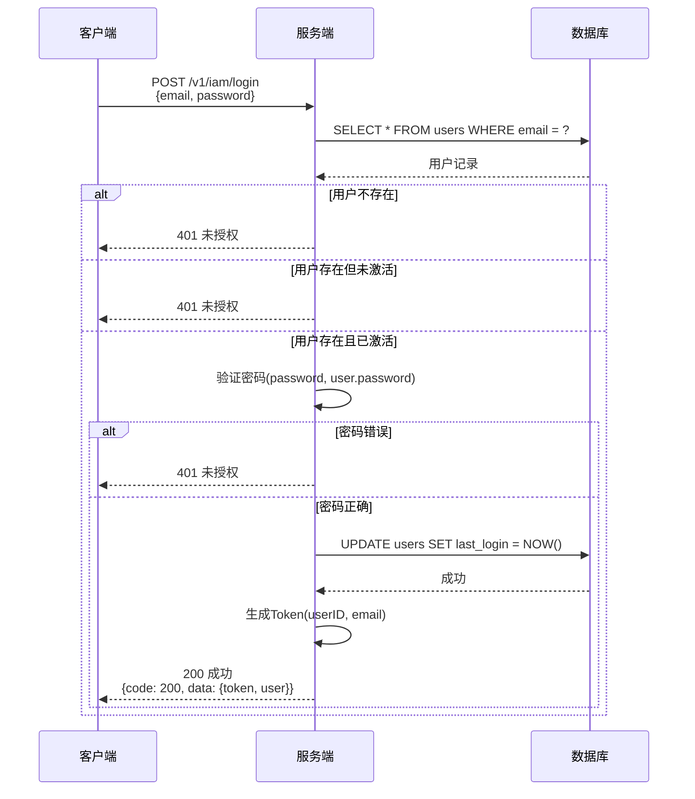
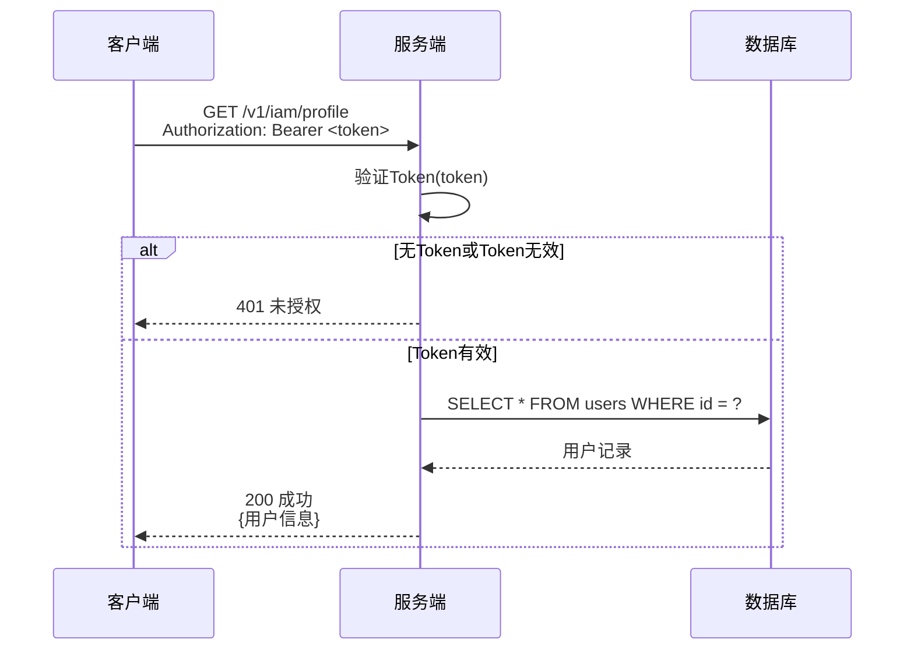
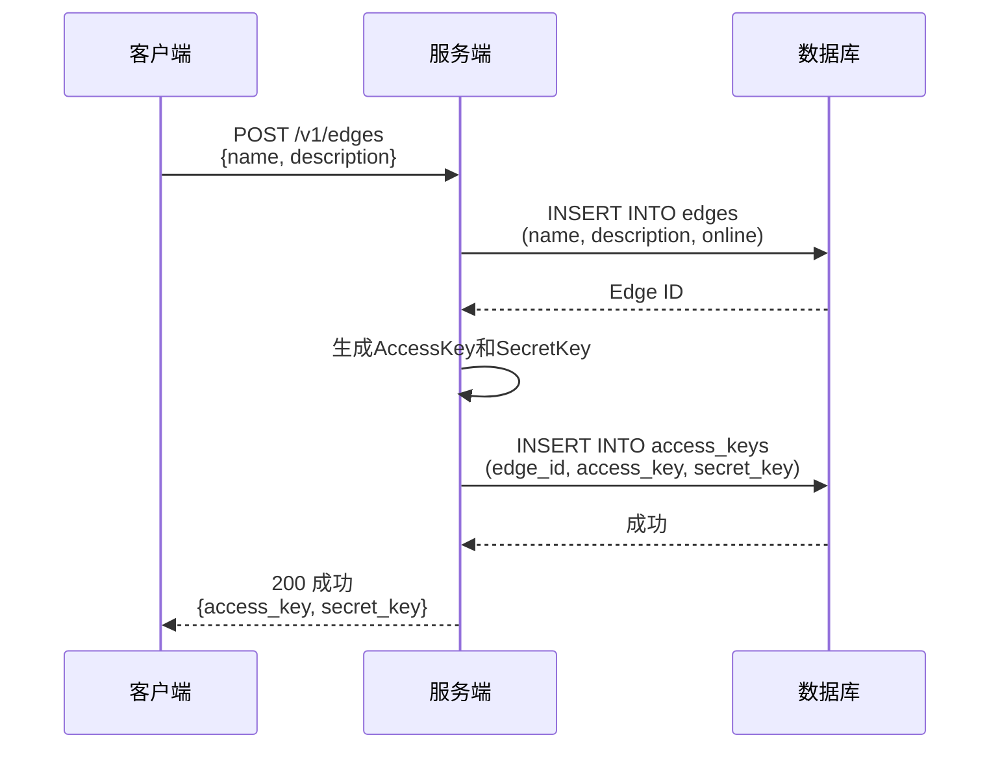
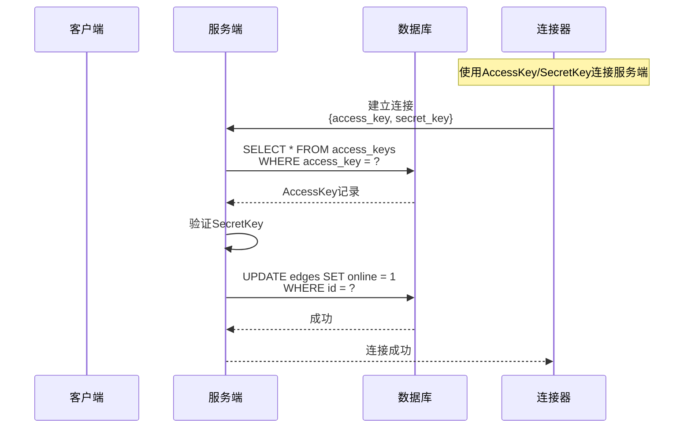
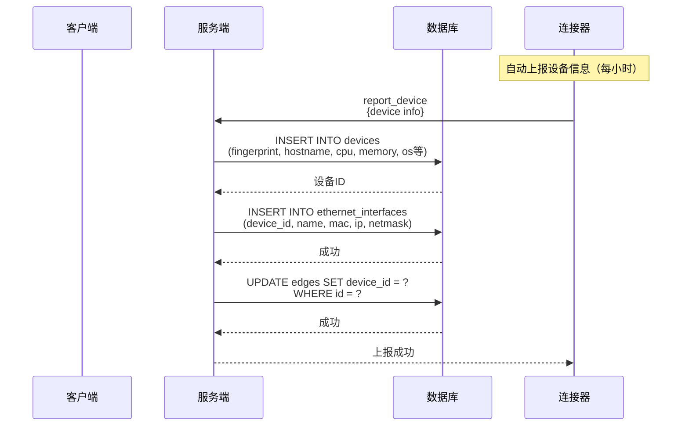
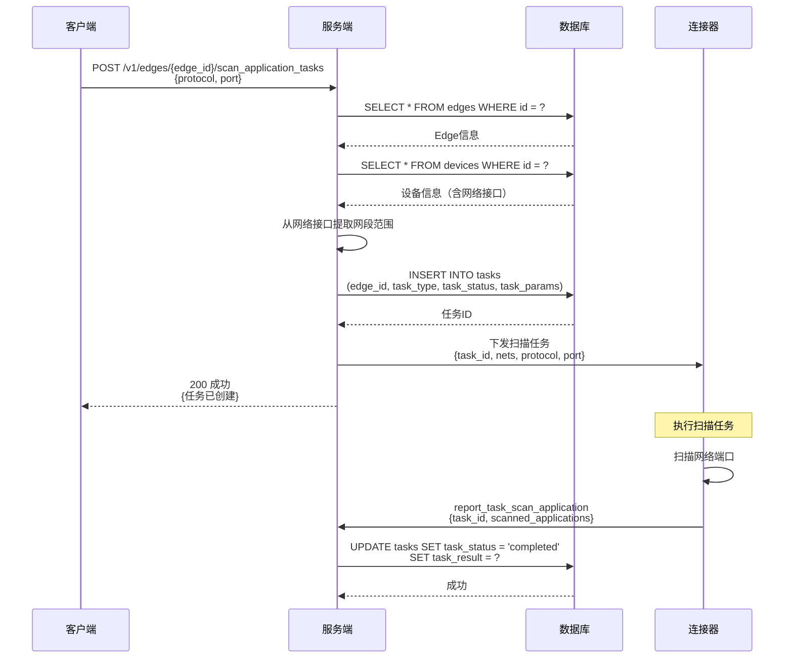
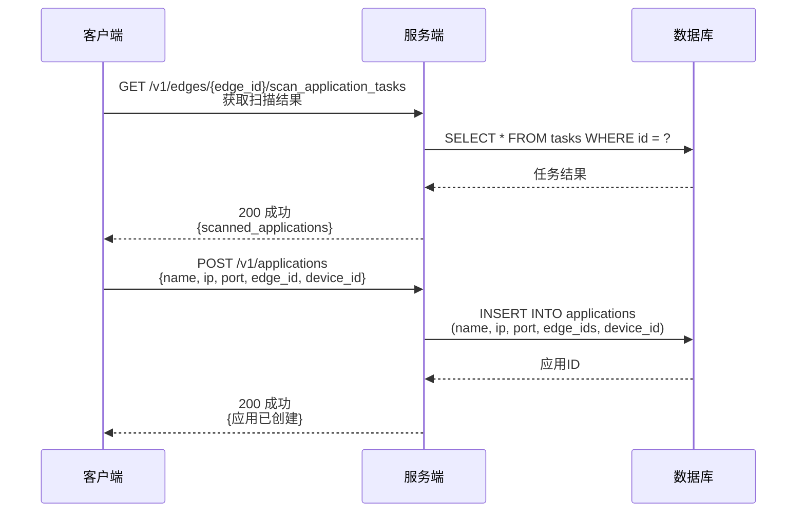
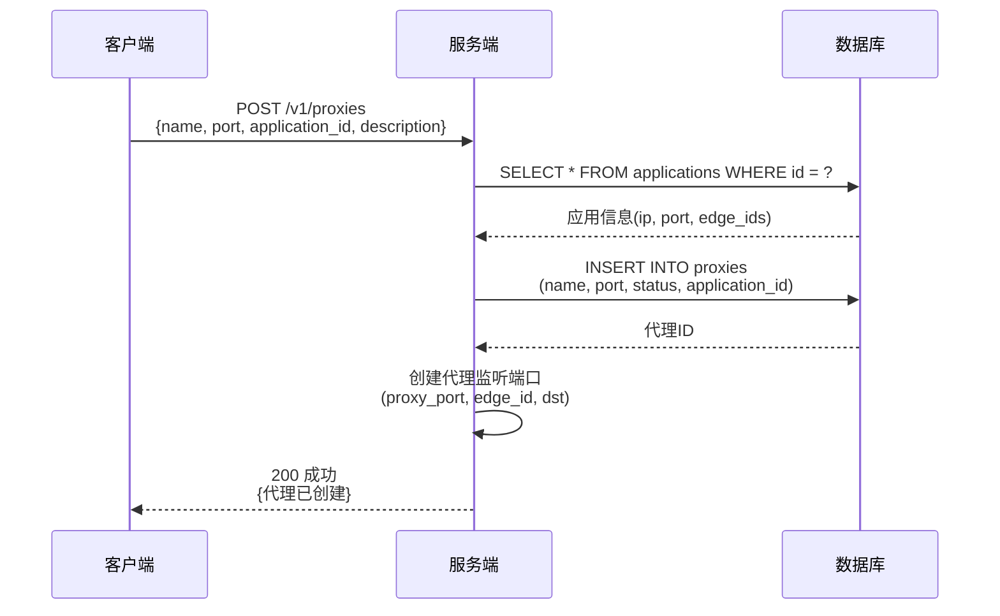
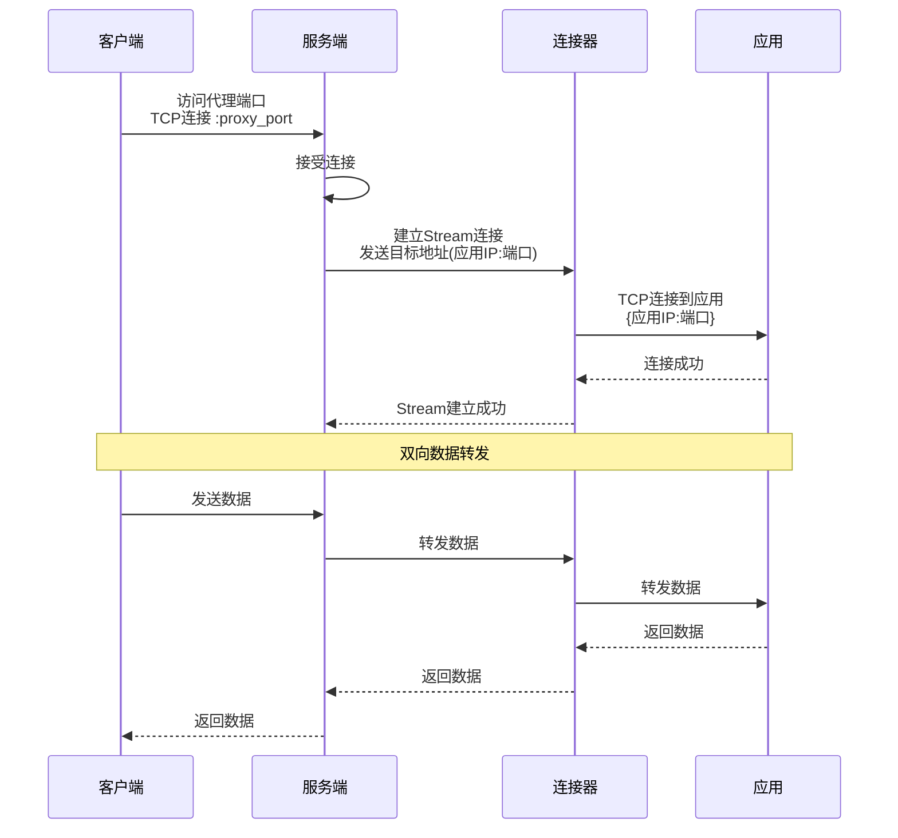

# 时序图

## 用户登录流程

```mermaid
sequenceDiagram
    participant 客户端
    participant 服务端
    participant 数据库

    客户端->>服务端: POST /v1/iam/login<br/>{email, password}
    
    服务端->>数据库: SELECT * FROM users WHERE email = ?
    数据库-->>服务端: 用户记录
    
    alt 用户不存在
        服务端-->>客户端: 401 未授权
    else 用户存在但未激活
        服务端-->>客户端: 401 未授权
    else 用户存在且已激活
        服务端->>服务端: 验证密码(password, user.password)
        
        alt 密码错误
            服务端-->>客户端: 401 未授权
        else 密码正确
            服务端->>数据库: UPDATE users SET last_login = NOW()
            数据库-->>服务端: 成功
            
            服务端->>服务端: 生成Token(userID, email)
            
            服务端-->>客户端: 200 成功<br/>{code: 200, data: {token, user}}
        end
    end
```

## Token 使用流程

```mermaid
sequenceDiagram
    participant 客户端
    participant 服务端
    participant 数据库

    客户端->>服务端: GET /v1/iam/profile<br/>Authorization: Bearer <token>
    
    服务端->>服务端: 验证Token(token)
    
    alt 无Token或Token无效
        服务端-->>客户端: 401 未授权
    else Token有效
        服务端->>数据库: SELECT * FROM users WHERE id = ?
        数据库-->>服务端: 用户记录
        服务端-->>客户端: 200 成功<br/>{用户信息}
    end
```

## 业务流程：连接器 → 设备 → 应用 → 代理

### 1. 创建连接器

```mermaid
sequenceDiagram
    participant 客户端
    participant 服务端
    participant 数据库

    客户端->>服务端: POST /v1/edges<br/>{name, description}
    服务端->>数据库: INSERT INTO edges<br/>(name, description, online)
    数据库-->>服务端: Edge ID
    服务端->>服务端: 生成AccessKey和SecretKey
    服务端->>数据库: INSERT INTO access_keys<br/>(edge_id, access_key, secret_key)
    数据库-->>服务端: 成功
    服务端-->>客户端: 200 成功<br/>{access_key, secret_key}
```

### 2. 安装连接器

```mermaid
sequenceDiagram
    participant 客户端
    participant 服务端
    participant 数据库
    participant 连接器

    Note over 连接器: 使用AccessKey/SecretKey连接服务端
    连接器->>服务端: 建立连接<br/>{access_key, secret_key}
    服务端->>数据库: SELECT * FROM access_keys<br/>WHERE access_key = ?
    数据库-->>服务端: AccessKey记录
    服务端->>服务端: 验证SecretKey
    服务端->>数据库: UPDATE edges SET online = 1<br/>WHERE id = ?
    数据库-->>服务端: 成功
    服务端-->>连接器: 连接成功
```

### 3. 连接器自动发现设备

```mermaid
sequenceDiagram
    participant 客户端
    participant 服务端
    participant 数据库
    participant 连接器

    Note over 连接器: 自动上报设备信息（每小时）
    连接器->>服务端: report_device<br/>{device info}
    服务端->>数据库: INSERT INTO devices<br/>(fingerprint, hostname, cpu, memory, os等)
    数据库-->>服务端: 设备ID
    服务端->>数据库: INSERT INTO ethernet_interfaces<br/>(device_id, name, mac, ip, netmask)
    数据库-->>服务端: 成功
    服务端->>数据库: UPDATE edges SET device_id = ?<br/>WHERE id = ?
    数据库-->>服务端: 成功
    服务端-->>连接器: 上报成功
```

### 4. 远程在连接器发起应用扫描

```mermaid
sequenceDiagram
    participant 客户端
    participant 服务端
    participant 数据库
    participant 连接器

    客户端->>服务端: POST /v1/edges/{edge_id}/scan_application_tasks<br/>{protocol, port}
    服务端->>数据库: SELECT * FROM edges WHERE id = ?
    数据库-->>服务端: Edge信息
    服务端->>数据库: SELECT * FROM devices WHERE id = ?
    数据库-->>服务端: 设备信息（含网络接口）
    服务端->>服务端: 从网络接口提取网段范围
    服务端->>数据库: INSERT INTO tasks<br/>(edge_id, task_type, task_status, task_params)
    数据库-->>服务端: 任务ID
    服务端->>连接器: 下发扫描任务<br/>{task_id, nets, protocol, port}
    服务端-->>客户端: 200 成功<br/>{任务已创建}
    
    Note over 连接器: 执行扫描任务
    连接器->>连接器: 扫描网络端口
    连接器->>服务端: report_task_scan_application<br/>{task_id, scanned_applications}
    服务端->>数据库: UPDATE tasks SET task_status = 'completed'<br/>SET task_result = ?
    数据库-->>服务端: 成功
```

### 5. 添加扫描出来的应用

```mermaid
sequenceDiagram
    participant 客户端
    participant 服务端
    participant 数据库

    客户端->>服务端: GET /v1/edges/{edge_id}/scan_application_tasks<br/>获取扫描结果
    服务端->>数据库: SELECT * FROM tasks WHERE id = ?
    数据库-->>服务端: 任务结果
    服务端-->>客户端: 200 成功<br/>{scanned_applications}
    
    客户端->>服务端: POST /v1/applications<br/>{name, ip, port, edge_id, device_id}
    服务端->>数据库: INSERT INTO applications<br/>(name, ip, port, edge_ids, device_id)
    数据库-->>服务端: 应用ID
    服务端-->>客户端: 200 成功<br/>{应用已创建}
```

### 6. 创建代理，指向应用

```mermaid
sequenceDiagram
    participant 客户端
    participant 服务端
    participant 数据库

    客户端->>服务端: POST /v1/proxies<br/>{name, port, application_id, description}
    服务端->>数据库: SELECT * FROM applications WHERE id = ?
    数据库-->>服务端: 应用信息(ip, port, edge_ids)
    服务端->>数据库: INSERT INTO proxies<br/>(name, port, status, application_id)
    数据库-->>服务端: 代理ID
    服务端->>服务端: 创建代理监听端口<br/>(proxy_port, edge_id, dst)
    服务端-->>客户端: 200 成功<br/>{代理已创建}
```

### 7. 访问代理，流量到应用

```mermaid
sequenceDiagram
    participant 客户端
    participant 服务端
    participant 连接器
    participant 应用

    客户端->>服务端: 访问代理端口<br/>TCP连接 :proxy_port
    服务端->>服务端: 接受连接
    服务端->>连接器: 建立Stream连接<br/>发送目标地址(应用IP:端口)
    连接器->>应用: TCP连接到应用<br/>{应用IP:端口}
    应用-->>连接器: 连接成功
    连接器-->>服务端: Stream建立成功
    
    Note over 客户端,应用: 双向数据转发
    客户端->>服务端: 发送数据
    服务端->>连接器: 转发数据
    连接器->>应用: 转发数据
    应用-->>连接器: 返回数据
    连接器-->>服务端: 返回数据
    服务端-->>客户端: 返回数据
```

